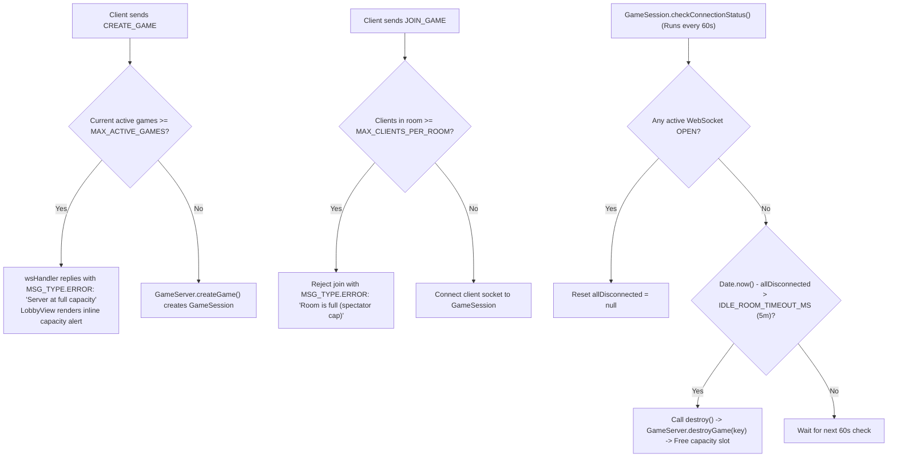

# Server Concurrency & Capacity Limits Plan

> **Date:** 2026-08-23  
> **Topic:** Server Capacity Caps, Concurrent Game Limits, and Idle Room Garbage Collection  
> **Status:** Completed  

---

## 1. Overview & Goals

To ensure the Node.js event loop remains responsive and does not suffer from frame drops or memory exhaustion during high traffic:
1. **Configurable Game Capacity (`MAX_ACTIVE_GAMES`):** Enforce an upper bound on concurrent active matches (default: `50`, configurable via `process.env.MAX_ACTIVE_GAMES` and `.env`).
2. **Room Client / Spectator Cap (`MAX_CLIENTS_PER_ROOM`):** Limit total connected sockets per room (default: `32`) to prevent socket flooding.
3. **Preservation & Enhancement of Inactivity Cleanup (`GameSession.checkConnectionStatus`):**
   - Retain the existing automatic inactivity reaper in `GameSession.js` where rooms with zero connected clients are auto-destroyed after `5` minutes (`IDLE_ROOM_TIMEOUT_MS`).
   - Cleanly prune closed socket references from `GameSession.clients`.
   - Ensure destroyed games immediately free capacity in `GameServer.games` and sync to persistent storage.
4. **Lobby UI Capacity Feedback:** When `CREATE_GAME` is rejected due to server capacity, display a non-intrusive inline retro warning message in the Lobby rather than silently failing.
5. **Headless Concurrency Benchmark Tool:** Create `scratch/benchmark-concurrency.js` to simulate 10, 25, and 50 simultaneous active rooms running at 40 FPS, measuring tick latency jitter and heap memory.

---

## 2. Architecture & Data Flow

---

## 3. Implementation Checklist

- [x] **Constants & Config ([`shared/constants.js`](shared/constants.js) & [`.env.example`](.env.example)):**
  - Define `MAX_ACTIVE_GAMES = parseInt(process.env.MAX_ACTIVE_GAMES, 10) || 50`.
  - Define `MAX_CLIENTS_PER_ROOM = 32`.
  - Define `IDLE_ROOM_TIMEOUT_MS = 5 * 60 * 1000` (5 minutes).
  - Add `MAX_ACTIVE_GAMES=50` to `.env.example`.
- [x] **Server Capacity Guardrails ([`server/GameServer.js`](server/GameServer.js) & [`server/wsHandler.js`](server/wsHandler.js)):**
  - In `GameServer.createGame()`, check capacity and return `null` / error if full.
  - In `wsHandler.js` on `CREATE_GAME`, respond with error if capacity reached.
  - In `wsHandler.js` on `JOIN_GAME`, reject if `roomClients.length >= MAX_CLIENTS_PER_ROOM`.
- [x] **Inactivity Reaper Awareness ([`server/GameSession.js`](server/GameSession.js)):**
  - Use `IDLE_ROOM_TIMEOUT_MS` in `checkConnectionStatus()`.
  - Prune closed sockets in `clients = clients.filter(c => c.readyState === WebSocket.OPEN)`.
- [x] **Lobby UI Error Feedback ([`public/javascripts/ui/lobbyView.js`](public/javascripts/ui/lobbyView.js) & [`public/javascripts/main.js`](public/javascripts/main.js)):**
  - Render inline capacity error notification below the create-game form.
- [x] **Concurrency Benchmark Tool & Test Suite ([`scratch/benchmark-concurrency.js`](scratch/benchmark-concurrency.js) & [`scratch/test-concurrency.js`](scratch/test-concurrency.js)):**
  - Automated benchmark measuring event loop lag across 50 concurrent active games.
  - Unit test verifying capacity rejection when `MAX_ACTIVE_GAMES` is reached.
- [x] **Documentation ([`README.md`](README.md) & [`ROADMAP.md`](ROADMAP.md)):**
  - Document capacity configuration and benchmark instructions in `README.md`.
  - Update `ROADMAP.md`.
