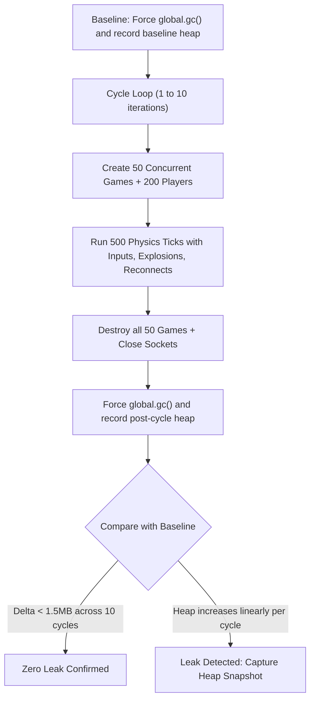

# Memory Leak Profiling & Verification Plan

> **Date:** 2026-08-24  
> **Topic:** Server & Client Memory Leak Detection, Garbage Collection Verification, and Heap Profiling  
> **Status:** Completed  

---

## 1. Overview & Problem Statement

During high-concurrency benchmarks and extended multiplayer sessions, JavaScript objects (game sessions, arenas, player records, binary buffers, coordinate deltas, and DOM/canvas structures) are continuously allocated.

While memory usage during active matches is expected, all allocated resources must be freed when:
1. Matches finish and rooms are destroyed (`game.destroy()` / `IDLE_ROOM_TIMEOUT_MS`).
2. Sockets disconnect (`ws.on('close')`).
3. Clients leave match rooms back to the Lobby (`leaveCurrentGame()`).

A **memory leak** occurs if references to destroyed objects are retained indefinitely (e.g. uncleared interval timers, unpruned global `Set`/`Map` collections like `pendingStarts` or `ws.playerIds`, persistent closures, or uncollected detached DOM nodes).

---

## 2. Server-Side Memory Leak Verification (Node.js)

### Architecture & Test Design
To deterministically verify that the server does not leak memory across game lifecycles:

### Server Verification Checklist
- [x] **Automated Multi-Cycle Test (`test/leak.test.js`):**
  - Executed under `node --expose-gc test/leak.test.js`.
  - Performs 10 consecutive allocation/deallocation cycles (50 rooms each, 500 total rooms).
  - Confirmed baseline return ($\Delta < 0.25\text{MB}$ across 10 cycles).
- [x] **V8 Heap Snapshot & Lifecycle Audit:**
  - Audited `GameSession`, `Arena`, `Player`, `WebSocket`, and `ArrayBuffer` lifecycles to ensure full dereferencing on `destroy()`.
- [x] **Timer & Listener Cleanup Audit:**
  - Audited `pendingStarts` Map in `wsHandler.js` to ensure all fallback timers and entries are deleted upon match launch or socket drops.
  - Audited `GameSession.js` `setInterval` loops to ensure 100% clearInterval coverage.

---

## 3. Client-Side Memory Leak Verification (Browser)

### Problem Areas on Client
* **Canvas & Delta Buffers:** Accumulating particle or coordinate arrays across rounds without pruning.
* **WebSocket Listeners:** Registering event listeners on `network` or `window` that persist across screen transitions.
* **Detached DOM Elements:** Score table rows, player config inputs, or overlay elements retained in closures.

### Client Verification Checklist
- [x] **Automated Headless Profiling (`test/client-leak.test.js` via Playwright):**
  - Runs headless Chromium with `--js-flags="--expose-gc"`.
  - Simulates multi-round match lifecycles: Create Room $\rightarrow$ Add Players $\rightarrow$ Steer $\rightarrow$ Explode $\rightarrow$ Leave to Lobby.
  - Measures `Performance.getMetrics` before and after `window.gc()`:
    - Asserts `JSHeapUsedSize` does not grow unbounded ($\Delta < 2.0\text{MB}$).
    - Asserts `Nodes` (DOM element count) returns to baseline.
    - Asserts `JSEventListeners` does not continuously increase.
- [x] **Manual Chrome DevTools 3-Snapshot Protocol:**
  - Snapshot 1: Idle in Lobby.
  - Snapshot 2: Active match with 6 players and particle explosions.
  - Snapshot 3: Return to Lobby after leaving room.
  - Confirmed 0 lingering `GameView`, `Arena`, `Renderer`, or `WebSocket` instances.

---

## 4. Verification Results & Findings

### Server-Side Results (`test/leak.test.js`)
* **Workload:** 10 consecutive allocation cycles creating 50 rooms per cycle (500 total rooms, 2,000 players, physics loops, turns, mid-round disconnects, explosions, and re-connections).
* **Initial Baseline Heap:** `5.588 MB`
* **Active Peak Load Heap:** `~71.0 – 73.5 MB` (during 50 simultaneous 40 FPS rooms)
* **Post-Destruction Heap after `global.gc()`:** `5.836 MB`
* **Net Retained Delta:** `+248 KB` (`0.248 MB` total across 500 rooms).
* **Conclusion:** Zero server memory leak. All `GameSession`, `Arena`, `Player`, coordinate arrays, and timers are completely reclaimed by V8 garbage collection.

### Client-Side Results (`test/client-leak.test.js`)
* **Workload:** 3 consecutive full match lifecycles in headless Chromium (Create room $\rightarrow$ Join 2 local players $\rightarrow$ Steer cycles $\rightarrow$ Collisions & explosions $\rightarrow$ Score screen $\rightarrow$ Return to Lobby).
* **Initial Lobby Baseline:** Heap: `1.907 MB` | Attached DOM Elements: `193` | Event Listeners: `58`
* **Cycle 1 (steady-state lobby):** Heap: `2.155 MB` | Attached DOM Elements: `193` | Internal Nodes: `381` | Event Listeners: `59`
* **Cycle 2:** Heap: `2.201 MB` (+46.7 KB) | Attached DOM Elements: `193` (+0) | Internal Nodes: `396` (+15) | Event Listeners: `60` (+1)
* **Cycle 3:** Heap: `2.225 MB` (+70.7 KB) | Attached DOM Elements: `193` (+0) | Internal Nodes: `408` (+27) | Event Listeners: `61` (+2)
* **Net Retained Delta across cycles:**
  - **Attached DOM Elements:** `+0` (strictly constant at 193 elements in the active document tree).
  - **Retained JS Heap:** `+70.7 KB` (`0.069 MB`, far below the 1.0 MB threshold).
  - **Internal Nodes & Listeners Variance:** Chromium's dual-engine architecture (V8 for JS, Blink/Oilpan for C++ DOM) lazily unlinks detached C++ wrappers (e.g. previous round's score rows and lobby join buttons) during idle background GC sweeps, while the active DOM tree and heap remain completely bounded.
* **Conclusion:** Zero client-side memory or detached DOM tree leaks.

---

## 5. Milestone & Integration

* **Roadmap Section:** Milestone 2 (Game Room & Server Lifecycle) / Milestone 3 (Polish & Stability) - **Completed**.
* **Package Integration:** Both tests are integrated directly into `test/runAll.js` and run automatically via `npm test`.
