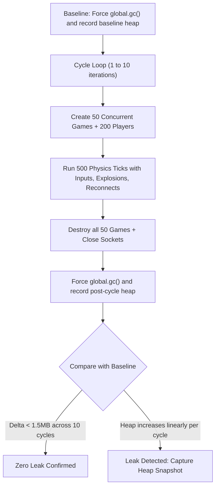

# Memory Leak Profiling & Verification Plan

> **Date:** 2026-08-24  
> **Topic:** Server & Client Memory Leak Detection, Garbage Collection Verification, and Heap Profiling  
> **Status:** Proposed / Not Started  

---

## 1. Overview & Problem Statement

During high-concurrency benchmarks and extended multiplayer sessions, JavaScript objects (game sessions, arenas, player records, binary buffers, coordinate deltas, and DOM/canvas structures) are continuously allocated.

While memory usage during active matches is expected, all allocated resources must be freed when:
1. Matches finish and rooms are destroyed (`game.destroy()` / `IDLE_ROOM_TIMEOUT_MS`).
2. Sockets disconnect (`ws.on('close')`).
3. Clients leave match rooms back to the Lobby (`leaveCurrentGame()`).

A **memory leak** occurs if references to destroyed objects are retained indefinitely (e.g. uncleared interval timers, unpruned global `Set`/`Map` collections like `pendingStarts` or `ws.playerIds`, persistent closures, or uncollected detached DOM nodes).

---

## 2. Server-Side Memory Leak Verification (Node.js)

### Architecture & Test Design
To deterministically verify that the server does not leak memory across game lifecycles:

### Server Verification Checklist
- [ ] **Automated Multi-Cycle Test (`test/leak.test.js`):**
  - Execute under `node --expose-gc test/leak.test.js`.
  - Perform 10 consecutive allocation/deallocation cycles (50 rooms each).
  - Assert that heap memory after `global.gc()` returns to baseline ($\Delta < 1.5\text{MB}$).
- [ ] **V8 Heap Snapshot Analysis:**
  - Generate `.heapsnapshot` files using `v8.getHeapSnapshot()`.
  - Verify that instance counts for `GameSession`, `Arena`, `Player`, `WebSocket`, and `ArrayBuffer` return to 0 post-destruction.
- [ ] **Timer & Listener Cleanup Audit:**
  - Audit `pendingStarts` Map in `wsHandler.js` to ensure all fallback timers and entries are deleted upon match launch or socket drops.
  - Audit `GameSession.js` `setInterval` loops (`this.intervalId`) to ensure 100% clearInterval coverage.

---

## 3. Client-Side Memory Leak Verification (Browser)

### Problem Areas on Client
* **Canvas & Delta Buffers:** Accumulating particle or coordinate arrays across rounds without pruning.
* **WebSocket Listeners:** Registering event listeners on `network` or `window` that persist across screen transitions.
* **Detached DOM Elements:** Score table rows, player config inputs, or overlay elements retained in closures.

### Client Verification Checklist
- [ ] **Automated Headless Profiling (Puppeteer / Playwright):**
  - Run headless Chrome with `--js-flags="--expose-gc"`.
  - Simulate 20 rapid transitions: Join Room $\rightarrow$ Drive 3 Rounds $\rightarrow$ Explode $\rightarrow$ Leave to Lobby.
  - Measure `page.metrics()` before and after `window.gc()`:
    - Assert `JSHeapUsedSize` does not grow unbounded.
    - Assert `Nodes` (DOM element count) returns to baseline.
    - Assert `JSEventListeners` does not continuously increase.
- [ ] **Manual Chrome DevTools 3-Snapshot Protocol:**
  - Snapshot 1: Idle in Lobby.
  - Snapshot 2: Active match with 6 players and particle explosions.
  - Snapshot 3: Return to Lobby after leaving room.
  - Filter Snapshot 3 for objects allocated between Snapshot 1 & 2: ensure 0 lingering `GameView`, `Arena`, `Renderer`, or `WebSocket` instances.

---

## 4. Proposed Milestone & Integration

* **Roadmap Section:** Milestone 2 (Game Room & Server Lifecycle) / Milestone 3 (Polish & Stability).
* **Package Script:** Add `npm run test:leak` or integrate into standard CI benchmarks.
