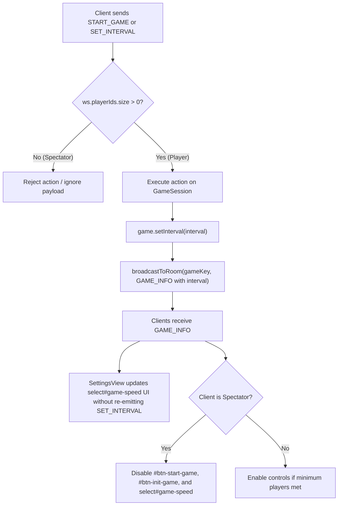

# Spectator Permissions & Speed Synchronization Plan

> **Date:** 2026-08-24  
> **Topic:** Spectator Action Restraint (Start/Speed Controls) and Multi-Client Speed Synchronization  
> **Status:** Completed  

---

## 1. Overview & Goals

1. **Spectator Permissions Restraint:**
   - A spectator (a connected WebSocket client with `0` registered local players) must not be able to:
     - Click "Start Game" on the configuration screen (`#btn-init-game`).
     - Click "Start Game" on the score screen (`#btn-start-game`).
     - Modify the game speed dropdown in Settings (`select#game-speed`).
   - Server-side guardrails: `wsHandler.js` rejects `START_GAME` and `SET_INTERVAL` messages from any socket where `ws.playerIds.size === 0`.
2. **Multi-Client Speed Synchronization:**
   - When a room player changes the game speed:
     - The server updates `game.setInterval(interval)` and persists it.
     - The server broadcasts updated `GAME_INFO` (including `interval`) to all room clients.
     - All connected clients (both other players and spectators) immediately update their Settings speed selector to match the room's live setting.
   - When any client joins or receives `GAME_INFO`, their local speed selector reflects `info.interval`.

---

## 2. Architecture & Data Flow

---

## 3. Implementation Checklist

- [x] **Server Speed & Authorization Guardrails ([`server/GameServer.js`](server/GameServer.js), [`server/GameSession.js`](server/GameSession.js), [`server/wsHandler.js`](server/wsHandler.js)):**
  - Include `interval: game.interval` in `gameServer.getGameInfo()`.
  - In `GameSession.setInterval()`, call `this.onChange?.()` to sync storage.
  - In `wsHandler.js` on `MSG_TYPE.START_GAME`: Enforce `if (ws.playerIds.size === 0) return`.
  - In `wsHandler.js` on `MSG_TYPE.SET_INTERVAL`: Enforce `if (ws.playerIds.size === 0) return` and broadcast `GAME_INFO`.
- [x] **Client UI Spectator Restraints & Speed Synchronization:**
  - In [`public/javascripts/ui/configView.js`](public/javascripts/ui/configView.js): Disable `btnInitGame` if `!hasLocalPlayers`.
  - In [`public/javascripts/ui/gameView.js`](public/javascripts/ui/gameView.js): Disable `startBtn` if `!hasLocalPlayers`.
  - In [`public/javascripts/ui/settingsView.js`](public/javascripts/ui/settingsView.js): Add `setSpeed()` / `setSpectatorMode()` helpers to update dropdown without re-triggering network calls.
  - In [`public/javascripts/main.js`](public/javascripts/main.js): In `GAME_INFO` handler, update speed UI and spectator permissions.
- [x] **Automated Tests:**
  - Create `test/spectator-speed.test.js` to verify spectator rejection on `START_GAME` / `SET_INTERVAL` and verify speed sync.
  - Add to `npm test` via `test/runAll.js`.
- [x] **Documentation:**
  - Update `ROADMAP.md` and `README.md`.
