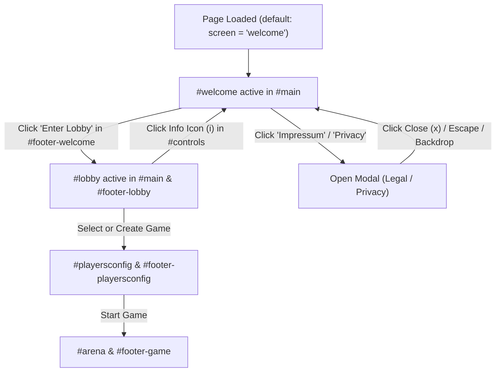

# Welcome View, Branding & Legal Scaffold Plan

> **Date:** 2026-08-28  
> **Topic:** Landing View, Dedicated Footer, Legal & Privacy Modals, and Branding Update  
> **Status:** Completed  

---

## 1. Overview & Objectives

1. **Rebranding / Title Harmonization:**
   - Update project title to **Bitcycles** (with subtitle *"Web Tribute to C64 Lightcycle Arenas"* or configurable template title).
   - Ensure title is consistent across Express route rendering, HTML head, and UI headers.
2. **Initial Welcome / Landing Screen:**
   - On initial page load (or visiting `/`), present an engaging retro landing card in `#main` (screen state: `'welcome'`).
   - Content includes:
     - **Hero & Tribute Back-story:** Tribute to the 1989 Commodore 64 classic *Ultimate Tron II* (Oliver Stiller / Masters' Design Group).
     - **Game Features & Multi-player Modes:** 6 players on 1 keyboard or cross-device real-time WebSockets.
     - **Open Source & Tech Stack:** Vanilla ES Modules, HTML5 Canvas Delta Renderer, 40 FPS target-timestamp physics loop, with a link to the GitHub repository.
     - **Legal & Disclaimer Note:** Clear non-commercial/independent tribute note and links to open the *Impressum* and *Privacy Policy*.
3. **Dedicated `#footer-welcome`:**
   - Primary Call-to-Action button: `Enter Lobby →` inside `#footer`.
   - In portrait/desktop: Centered in the footer below `#main`.
   - In mobile landscape (`@media (orientation: landscape) and (max-height: 800px)`): Positioned in the dedicated right-hand column next to `#main`, fully accessible without overlapping scrollable text.
4. **Header Info Navigation:**
   - Add an Info button (`i` / `ri-information-line`) in the `#controls` header dropdown or toolbar allowing players to return to the Welcome / About view at any time from the lobby without interrupting their connection.
5. **Legal Notice (Impressum) & Privacy (Datenschutz) Modals:**
   - Self-contained retro modals / overlay cards for:
     - **Impressum (§ 5 DDG):** Operator contact and legal notice scaffold.
     - **Privacy Policy (DSGVO / GDPR):** Transparent disclosure of zero cookies, zero third-party analytics, and server-side in-memory telemetry (active rooms, peak concurrent matches, player counts, ping).

---

## 2. User Flow & State Machine

---

## 3. Architecture & File Changes

### A. Server Routes & Title Config
* **[`routes/index.js`](routes/index.js):**
  - Update route render title to `'Bitcycles'`.

### B. Templates (`views/`)
* **[`views/index.pug`](views/index.pug):**
  - Add `#welcome` container inside `#main` containing structured intro sections, GitHub link, and trigger buttons for Impressum and Privacy modals.
  - Add `#footer-welcome` inside `#footer` containing the primary `Enter Lobby` button (`#btn-enter-lobby`).
  - Add modal dialog structure `#modal-legal` and `#modal-privacy` with close buttons.
* **[`views/controls.pug`](views/controls.pug):**
  - Add Info button `#btn-info` (`i(class='ri-information-line')`) in the controls area to allow switching back to the welcome screen from the lobby.

### C. Client Script Controllers (`public/javascripts/`)
* **`public/javascripts/ui/welcomeView.js` (New):**
  - Modular controller managing `#welcome`, `#footer-welcome`, and modal open/close actions (handling click, escape key, and backdrop click).
* **[`public/javascripts/main.js`](public/javascripts/main.js):**
  - Initialize `WelcomeView` with an `onEnterLobby` callback.
  - Wire up `#btn-info` in controls to trigger `this.setScreen('welcome')`.
  - Set default initial screen to `'welcome'`.
  - Update `updateScreenViews(screen)` to toggle `this.welcomeView`, `this.lobbyView`, `this.configView`, and `this.gameView`.
* **[`public/javascripts/state.js`](public/javascripts/state.js):**
  - Update initial default screen state from `'lobby'` to `'welcome'`.

### D. Stylesheets (`public/stylesheets/`)
* **[`public/stylesheets/components.css`](public/stylesheets/components.css) & [`public/stylesheets/layout.css`](public/stylesheets/layout.css):**
  - Add styling for `#welcome`: smooth vertical scrolling (`overflow-y: auto`), custom retro scrollbar, clean typography, badge links, and legal trigger buttons.
  - Add modal backdrop and modal dialog styles conforming to the existing CSS variable color palette (`--color-bg`, `--color-fg`, `--color-sky`, `--color-leaf`).
  - Verify landscape mobile layout (`@media (orientation: landscape) and (max-height: 800px)`) to ensure `#footer-welcome` neatly aligns in the 4th column.

---

## 4. Implementation Checklist

- [x] **1. Rebranding & Express Setup:**
  - [x] Update title in [`routes/index.js`](routes/index.js).
  - [x] Check branding references.
- [x] **2. Pug Templates:**
  - [x] Add `#welcome` view markup in [`views/index.pug`](views/index.pug).
  - [x] Add `#footer-welcome` in [`views/index.pug`](views/index.pug).
  - [x] Add `#btn-info` in [`views/controls.pug`](views/controls.pug).
  - [x] Add Impressum and Privacy modals in [`views/index.pug`](views/index.pug).
- [x] **3. Frontend Client Controller:**
  - [x] Create `public/javascripts/ui/welcomeView.js`.
  - [x] Update [`public/javascripts/main.js`](public/javascripts/main.js) and [`public/javascripts/state.js`](public/javascripts/state.js).
- [x] **4. Stylesheet Enhancements:**
  - [x] Style `#welcome` scrollable content, buttons, badges, and modals in `public/stylesheets/components.css`.
  - [x] Validate responsive behavior across desktop, portrait mobile, and landscape mobile.
- [x] **5. Automated Testing:**
  - [x] Create `test/welcome-view.test.js` validating screen switching, modal toggling, Express route rendering, and lobby navigation.
  - [x] Run `npm test` and `npx eslint .` to ensure zero regressions.
- [x] **6. Documentation:**
  - [x] Update `README.md`, `CHANGELOG.md`, and `ROADMAP.md`.
