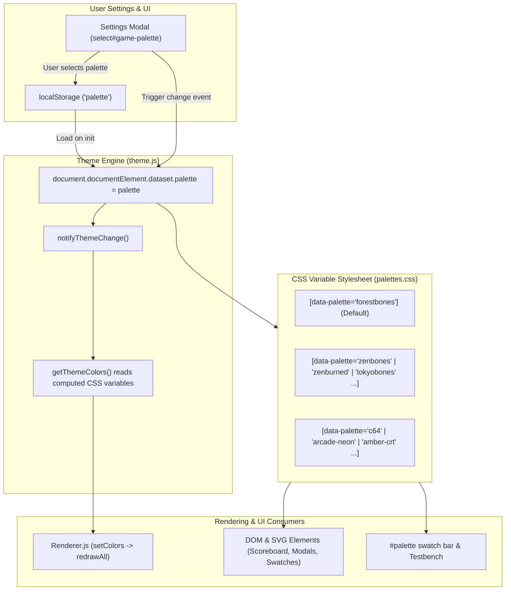

# Multi-Palette Color Schemes & Testing Strategy Plan

> **Date:** 2026-09-05  
> **Topic:** Multiple Color Schemes (Zenbones Family & Retro/Non-Editor Palettes) and Palette Verification Strategy  
> **Status:** Completed  

---

## 1. Overview & Objectives

1. **Multi-Palette Color Theming Architecture:**
   - Extend the existing CSS variable theming engine (`--color-bg`, `--color-fg`, `--color-water`, etc.) to support hot-swappable color palettes beyond the current hardcoded `forestbones` theme.
   - Decouple color palette definition from `:root` by using scoped attribute selectors (`[data-palette="..."]` on `<html>`).
   - Preserve full compatibility with `light-dark()` color resolution and the `auto` / `light` / `dark` user mode toggles.

2. **Curated Palette Catalog:**
   - **Zenbones Neovim Family:** Implement balanced presets from the Zenbones collection:
     - `forestbones` (current default, forest/moss retro tones)
     - `zenbones` (neutral, balanced monochromatic bone)
     - `zenburned` (warm vintage Zenburn-inspired amber/charcoal)
     - `tokyobones` (Tokyo Night-inspired cool slate and vibrant neon)
     - `rosebones` (Rosé Pine-inspired dusty rose and muted cedar)
     - `nordbones` (Nordic arctic blues, frosted glass, and cold stone)
     - `duckbones` (deep ocean teal and dusk hues)
     - `seoulbones` (Seoul256 soft low-contrast pastels)
   - **Retro & Display Aesthetic Palettes (Non-Editor):**
     - `c64` (Commodore 64 16-color VIC-II palette — dedicated tribute to Oliver Stiller's *Ultimate Tron II*)
     - `arcade-neon` (high-contrast synthwave neon on deep pitch black)
     - `amber-crt` (vintage monochrome amber phosphor monitor with stepped luminance)
     - `green-crt` (vintage monochrome P1 green phosphor CRT monitor)

3. **User Experience & Settings Integration:**
   - Add a "Color Scheme" dropdown selector to the Settings modal ([`SettingsView`](../../public/javascripts/ui/settingsView.js)).
   - Persist selected palette in `localStorage` (`palette`).
   - Dynamically re-resolve CSS variables on the fly: instantly updating canvas light-cycle trails, arena borders, particle explosions, scoreboard text, and UI modals without page reloads.

4. **Testing, Verification & Palette Approval Strategy:**
   - Provide automated mathematical tools and visual inspection environments to rigorously test contrast, player trail discriminability, and accessibility (colorblindness) before approving palettes into production.

---

## 2. Architecture & Data Flow

### Color Mapping Contract
Every palette implements the standard 9 semantic color tokens in both light and dark modes:
* **UI Backgrounds:** `--color-bg`, `--color-bg-hl`, `--color-bg-muted`
* **UI Foregrounds / Borders:** `--color-fg`, `--color-fg-hl`, `--color-fg-muted`
* **Explosions & Highlight:** `--color-rose` (also available as player color fallback)
* **6 Light-Cycle Player Trails:**
  1. `--color-water` (Player 0)
  2. `--color-wood` (Player 1)
  3. `--color-leaf` (Player 2)
  4. `--color-blossom` (Player 3)
  5. `--color-sky` (Player 4)
  6. `--color-rock` (Player 5)

Each color token generates `-hl` and `-muted` variants (using native CSS `hsl(from var(...) ...)` or custom palette tuning) to support borders, backgrounds, and scoreboard states.

---

## 3. Palette Testing & Approval Proposal

To evaluate, refine, and approve color palettes systematically, we propose a three-tier verification suite:

### Tier 1: Automated Mathematical Contrast & Discriminability Test (`test/palette.test.js`)
A headless Node.js test executing during `npm test`:
1. **WCAG 2.1 AA Contrast Ratios:**
   - **Text Readability:** `--color-fg` on `--color-bg` must meet $\ge 4.5:1$ in both light and dark variants.
   - **Trail Visibility:** All 6 player colors and `--color-rose` must achieve $\ge 3.0:1$ graphical contrast against `--color-bg`.
2. **Perceptual Player Color Distance (CIELAB $\Delta E^*$):**
   - Light-cycles move at up to 50 FPS; players must never mistake their vehicle for an opponent.
   - Computes pairwise perceptual Euclidean color distance $\Delta E^*$ across all 15 player pairings ($\binom{6}{2}$).
   - Enforces minimum threshold ($\Delta E^* \ge 25$) to guarantee distinct hues.
3. **Color Vision Deficiency (CVD) Simulation:**
   - Tests contrast under simulated Deuteranopia (green-blind) and Protanopia (red-blind) transformation matrices.

### Tier 2: Standalone Static HTML Visual Gallery (`scripts/generate-palette-gallery.js`)
An automated generator producing an offline, single-page visual comparison report (`test/reports/palette-gallery.html`):
- Generates side-by-side mock canvas screenshots for every palette:
  - Arena canvas with 6 crossing trails, borders, and explosion particles.
  - Light mode vs Dark mode rendered side-by-side.
  - Scoreboard overlay table with player ranks and total scores.
  - Swatch blocks showing base, `-hl`, and `-muted` tokens.
- **Workflow:** Run `npm run test:palettes`, then open the generated HTML file in Chrome/Firefox to visually approve all palettes in under 2 minutes.

### Tier 3: In-App Interactive Testbench (`/#palette-preview`)
An in-browser preview mode built directly into the client application:
- Accessible by navigating to `/#palette-preview` or clicking an "Inspect Palettes" button in Settings when `#palette` is visible.
- Renders a dummy test arena simulating all 6 cycles moving and crashing in a loop without requiring a multi-client WebSocket game.
- Includes a live palette switcher and simulated SVG CVD filters (Normal, Protanopia, Deuteranopia, Tritanopia, Monochrome) to visually test gameplay visibility in real time.

---

## 4. File Changes & Implementation Breakdown

### A. Stylesheet Architecture (`public/stylesheets/`)
* **`public/stylesheets/palettes.css` (New):**
  - Define all color schemes with `[data-palette="..."]` selectors and `light-dark()` values.
  - Retain `public/stylesheets/var.css` for structural variables (`--block-size`, `--multiplicator`, layout dimensions) while importing `palettes.css`.
  - Default `:root` to `forestbones` for seamless backward compatibility.

### B. Client Settings & State (`public/javascripts/`)
* **[`public/javascripts/settings.js`](public/javascripts/settings.js):**
  - Add `palette` property (default: `'forestbones'`) stored in `localStorage`.
  - Add `palette` change listeners to `this.listeners`.
* **[`public/javascripts/theme.js`](public/javascripts/theme.js):**
  - Bind `document.documentElement.dataset.palette = settings.palette`.
  - Trigger `notifyThemeChange()` whenever `settings.palette` changes.
* **[`public/javascripts/ui/settingsView.js`](public/javascripts/ui/settingsView.js):**
  - Add dropdown `<select id="game-palette">` with grouped option categories (*Zenbones Themes*, *Retro & Display*).
  - Sync UI on external or storage changes.

### C. Templates (`views/`)
* **[`views/settings.pug`](views/settings.pug):**
  - Render the palette selection dropdown inside the Settings modal.

### D. Automated Testing & Verification
* **`test/palette.test.js` (New):**
  - Unit test verifying all palettes pass contrast and discriminability thresholds.
* **`scripts/generate-palette-gallery.js` (New):**
  - Script outputting `test/reports/palette-gallery.html`.

---

## 5. Implementation Phases & Checklist

- [x] **Phase 1: Palette Definition & Architecture**
  - [x] Create `public/stylesheets/palettes.css` with `forestbones` baseline.
  - [x] Implement Zenbones presets (`zenbones`, `zenburned`, `tokyobones`, `rosebones`, `nordbones`, `duckbones`, `seoulbones`).
  - [x] Implement retro presets (`c64`, `arcade-neon`, `amber-crt`, `green-crt`).
- [x] **Phase 2: Theme Engine & Settings Integration**
  - [x] Update `public/javascripts/settings.js` with `palette` preference.
  - [x] Update `public/javascripts/theme.js` to observe `settings.palette` and update `documentElement.dataset.palette`.
  - [x] Add palette dropdown in `views/controls.pug` and `public/javascripts/ui/settingsView.js`.
- [x] **Phase 3: Testing Suite & Automated Verification**
  - [x] Create `test/palette.test.js` with WCAG contrast and CIELAB color distance checks.
  - [x] Integrate into `test/runAll.js` runner.
- [x] **Phase 4: Palette Approval & Visual Tools**
  - [x] Build standalone visual gallery generator `scripts/generate-palette-gallery.js`.
  - [x] Review all palettes with the maintainer for visual balance, aesthetics, and accessibility approval.
- [x] **Phase 5: Documentation & Roadmap Synchronization**
  - [x] Update [`docs/architecture/rendering.md`](docs/architecture/rendering.md) documenting the multi-palette architecture, `[data-palette]` token contract, and live canvas re-resolution.
  - [x] Update [`docs/architecture/testing.md`](docs/architecture/testing.md) documenting the new automated palette contrast and color distance test suite.
  - [x] Update [`GEMINI.md`](GEMINI.md) (`## Architecture & Domain Guides`) keeping the domain guide summaries synchronized with the new theming and test capabilities.
  - [x] Update [`CHANGELOG.md`](CHANGELOG.md) under `[Unreleased]` with player-facing changes.
  - [x] Update [`ROADMAP.md`](ROADMAP.md) moving completed milestone items to `## Completed Milestones`.
