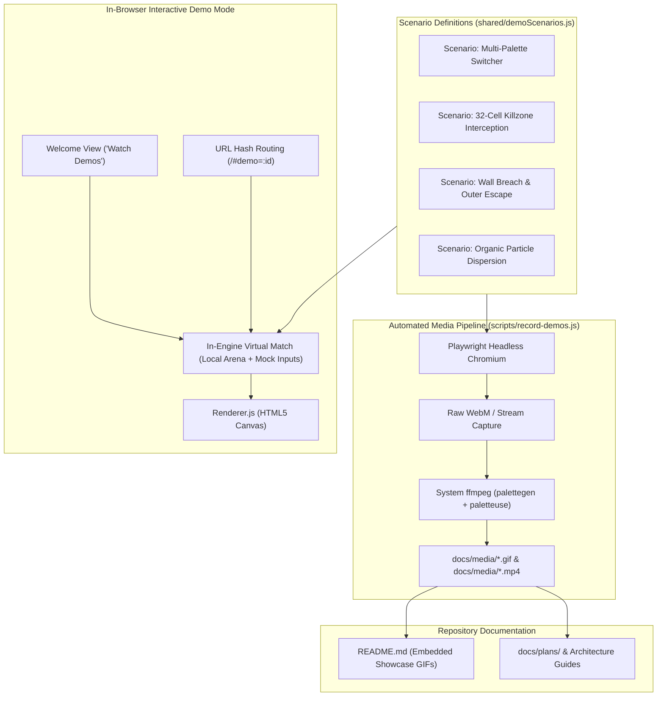

# Feature Demo Showcase & Automated Media Recording Pipeline Plan

> **Date:** 2026-09-06  
> **Topic:** In-Engine Scripted Feature Demos & Automated Video/GIF Asset Pipeline  
> **Status:** Draft / Ready for Implementation  

---

## 1. Background & Technical Context (User Q&A Reference)

This plan addresses the implementation of visual showcase assets (GIFs/videos) for the GitHub project page and README, as well as an in-engine interactive demonstration system.

### Technical Analysis of Feature Inquiries

#### Q1: Can we generate videos and animated GIFs of gameplay features?
**Answer: Yes.**
- **Existing Project Dependencies:** The project devDependencies include `playwright` (`^1.62.1`), and the host environment provides `/usr/bin/ffmpeg`.
- **Headless Video Capture:** Playwright's Chromium engine can record page sessions or canvas frame streams at native simulation speeds.
- **Pixel-Art Optimization via ffmpeg:** Light-cycle graphics require crisp, non-interpolated pixel rendering. By piping captured streams through `ffmpeg` using nearest-neighbor scaling (`flags=neighbor`) and two-pass palette quantization (`palettegen` + `paletteuse`), we can produce small, high-framerate, loopable `.gif` files alongside optimized `.mp4` / `.webm` clips with zero blur or compression artifacting.

#### Q2: Can we provide selectable in-game scripts working as demos of said features?
**Answer: Yes, creating a unified architecture.**
- Rather than maintaining separate video assets and demo routines, we can build a lightweight **in-engine scripted scenario runner** (`demoRunner.js` / `demoScenarios.js`).
- **Dual Benefit:**
  1. **Interactive In-Browser Demos:** Visitors to `bitcycles.net` or local instances can click "Watch Demos" on the Welcome screen or deep-link via URL hash (e.g. `/#demo=escape`, `/#demo=kill`, `/#demo=themes`, `/#demo=explosions`) to watch the canvas engine simulate matches in real-time at 60 FPS without downloading media files.
  2. **Automated Headless Asset Recording:** The automated recording tool (`scripts/record-demos.js`) runs these exact same scenarios headlessly in Playwright, ensuring recorded GIFs always reflect actual engine mechanics.

#### Q3: Are explosions really "random" and do they feel "organic/natural"?
**Answer: Yes, verified directly in the simulation engine.**
Inspection of [`server/Explosion.js`](../../server/Explosion.js) and [`server/Arena.js`](../../server/Arena.js) reveals the physics simulation driving explosions:
1. **Particle Count Variation:** Each explosion spawns between 16 and 20 individual particles (`getRandomInt(16, 20)` in `Explosion.js`).
2. **Full Radian Dispersion:** Every particle receives a distinct trajectory sampled uniformly across $360^\circ$ continuous radians (`getRandomRadian() = Math.round(Math.random() * 2 * Math.PI * 1000) / 1000`).
3. **Non-Linear Velocity Profile:** Particle velocities are drawn from `[1, 0.75, 0.5, 0.5, 0.5, 0.25, 0.25, 0.25, 0.125]`. The majority move at slow-to-medium speeds forming a dense inner blast core, while occasional fast sparks shoot outward.
4. **Staggered Frame Launch Delays:** Each particle has a randomized release delay between 0 and 12 frames (`getRandomInt(0, 12)`). Rather than an instantaneous geometric circle, the explosion expands progressively as a rolling, dynamic shockwave.
5. **Variable Lifespan & Max Distance:** Particles travel between 18 and 30 pixels (`getRandomInt(18, 30)`) before extinguishing.
6. **Destructive Wall Breaching & Escaping:** As particles travel, they clear previous grid cells to `CELL_TYPE.EMPTY` (`Arena.js`). When an explosion occurs adjacent to an arena wall, particles tear irregular, organic gaps in the border. If an active light-cycle navigates into any border coordinate (`x === 0 || x === xMax || y === 0 || y === yMax`) that has been cleared (`fields[x][y] === CELL_TYPE.EMPTY`), the player does not crash; instead, `player.escaped = true` is set, awarding $3\times$ round points and an instant victory.
7. **Killzone Window:** Kills are not awarded for collisions with arbitrary light trails. A kill is only scored if a victim crashes into the killer's `killzone` — the trailing 32 pixels directly behind the cycle's head (`KILLZONE_LENGTH = 32`). Crashing into older trails is classified as an obstacle collision (suicide).

---

## 2. Architecture & Data Flow



---

## 3. Showcase Scenarios

### 1. Palette Hot-Swapping (`themes`)
- **Action:** A four-cycle match runs in a serpentine pattern across the grid.
- **Showcase:** The demo smoothly cycles through color palettes (`forestbones` -> `c64` -> `arcade-neon` -> `amber-crt` -> `rosebones` -> `tokyobones`), demonstrating live CSS variable re-resolution, light-dark adaptability, and instant canvas recoloring without resetting match state.

### 2. Close-Quarters Killzone Cut-Off (`kill`)
- **Action:** Player 0 (water) races parallel to Player 1 (wood). Player 0 executes a 90-degree turn directly cutting across Player 1's path within the 32-pixel `killzone` window.
- **Showcase:** Player 1 crashes into Player 0's active tail, the explosion triggers, and the score announcement displays `Player 0 kills Player 1` with killer bonus points.

### 3. Explosive Wall Breach & Escape (`escape`)
- **Action:** Player 0 steers directly into the left arena border near $(0, 80)$, triggering an explosion. The randomized particles blow a jagged 8-to-12 cell gap through the border wall.
- **Showcase:** Player 1 maneuvers towards the breach and drives straight through the opening into the void. The game registers `Player 1 escaped!!!`, awards $3\times$ points, and completes the round.

### 4. Organic Explosion Physics (`explosions`)
- **Action:** Three simultaneous collisions at varying angles and velocities.
- **Showcase:** Replayed at normal speed followed by a brief slow-motion sequence highlighting the 16-20 particles per blast, non-linear velocity distribution, variable frame release delays, and natural dissipation.

---

## 4. Implementation Checklist & Execution Phases

### Phase 1: In-Engine Scripted Demo Engine & Scenarios
- [ ] Implement `public/javascripts/demo/demoScenarios.js` defining deterministic keyframes and turn sequences for the 4 showcase scenarios (`themes`, `kill`, `escape`, `explosions`).
- [ ] Implement `public/javascripts/demo/demoRunner.js` allowing local virtual simulation execution with standard `Renderer.js` without requiring an active remote WebSocket room.
- [ ] Verify that all 4 scenarios play reliably and loop cleanly.

### Phase 2: In-Game UI Integration & Deep-Linking
- [ ] Add a "Watch Demos" action button or selector to the Welcome screen (`#welcome`) and settings modal.
- [ ] Support URL hash navigation (e.g. `/#demo=themes`, `/#demo=kill`, `/#demo=escape`, `/#demo=explosions`) to automatically start and view demos.
- [ ] Provide a simple exit / return control allowing players to return to the Welcome screen or Lobby at any time (`Escape` key or "Exit Demo" overlay button).

### Phase 3: Automated Headless Recording CLI (`scripts/record-demos.js`)
- [ ] Create `scripts/record-demos.js` using Playwright Chromium to launch an isolated headless browser at standard DPI.
- [ ] Navigate to the demo routes with forced frame synchronization.
- [ ] Pipe recorded video through system `/usr/bin/ffmpeg` with two-pass color palette generation:
  ```bash
  ffmpeg -y -i raw.webm -vf "fps=20,scale=640:400:flags=neighbor,split[s0][s1];[s0]palettegen=max_colors=64[p];[s1][p]paletteuse" docs/media/<name>.gif
  ```
- [ ] Add `npm run record:demos` script to `package.json`.

### Phase 4: Asset Generation & README Integration
- [ ] Run the recording pipeline to generate optimized `.gif` and `.mp4` assets in `docs/media/`.
- [ ] Embed the showcase GIFs in `README.md` under a dedicated "Gameplay & Features" visual section.
- [ ] Update documentation and confirm all tests (`npm test`) continue passing.
